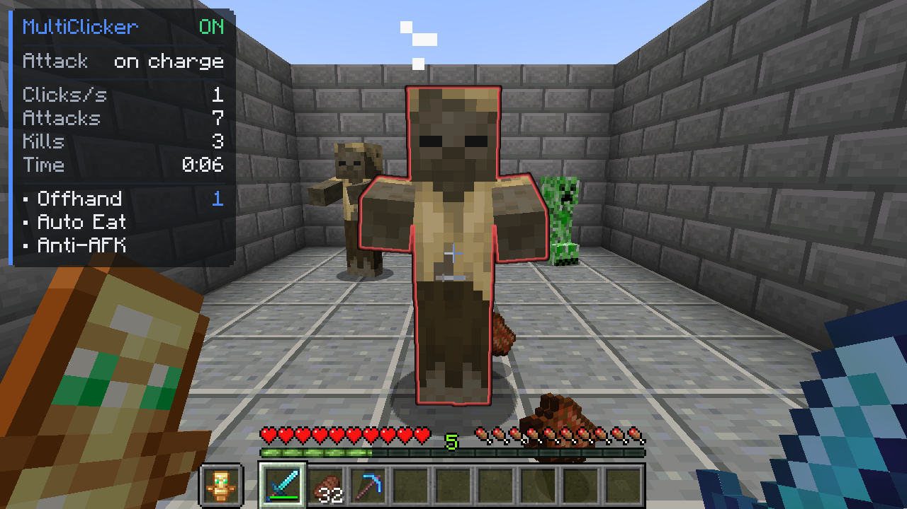
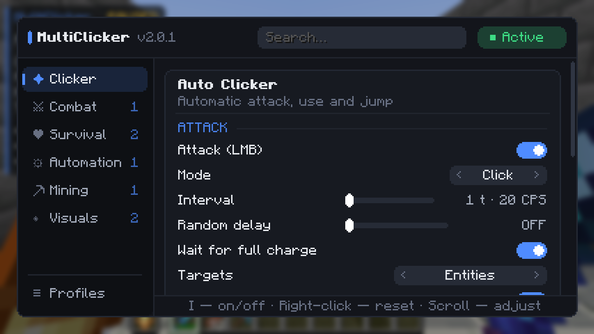
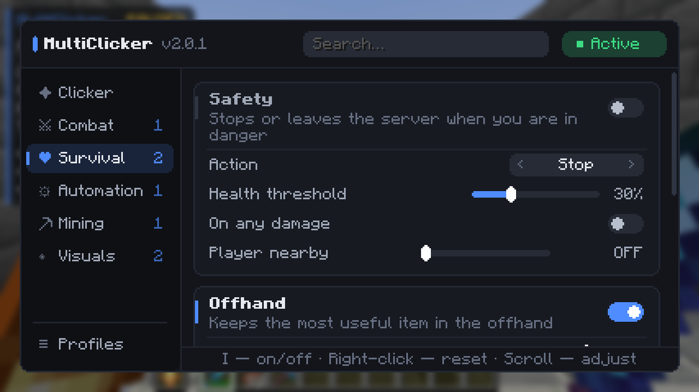
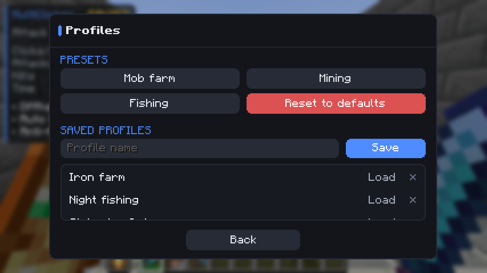
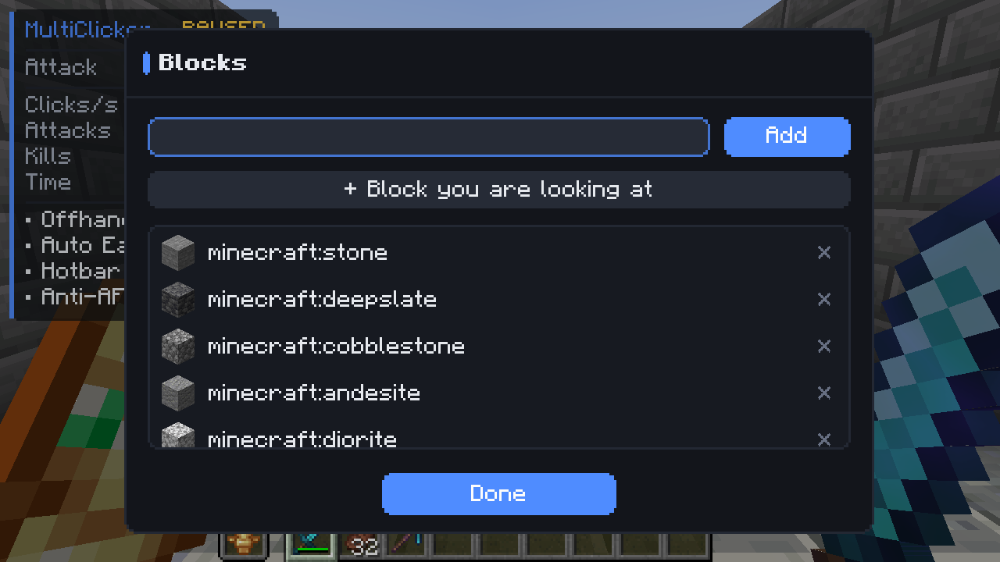

<div align="center">


# MultiClicker

**Auto clicker for Fabric with helpers for AFK farms, mining and fishing.**

[](https://minecraft.net/)
[](https://fabricmc.net/)
[](https://github.com/Shamanalle/MultiClicker/releases/latest)
[](https://github.com/Shamanalle/MultiClicker/actions/workflows/gametest.yml)
[](LICENSE)

**English** · [Русский](README.ru.md)



</div>

- **Plays like a hand on the mouse.** The mod presses the game's own keys, so the attack cooldown,
  block breaking and server sync work exactly as in normal play. Keys you hold yourself are never
  released.
- **The helpers don't fight each other.** Auto eat, auto tool, the offhand and the clicker take turns
  with the hotbar. None of them swaps an item out from under another, and each gives your slot back.
- **Tested in a real game.** Every push starts Minecraft in CI and plays 14 scenarios in a real
  world: fights, eating, mining, fishing, safety stops.

## Features

| | Module | What it does |
|:--|:--|:--|
| **Clicker** | Auto clicker | Separate attack, use and jump channels. Each can click or hold, with its own interval, hold time and random delay. It can wait for a full weapon charge, strike the killing blow with your Looting weapon, lock the camera, stop after an attack or time limit, and keep running while the window is in the background. |
| **Combat** | Target filter | Players, hostile, neutral and passive mobs, other entities. It can skip babies, named mobs, pets and invisible mobs. Armor stands are never hit by default. |
| **Survival** | Safety | Stops the mod, or leaves the server, when your health is low, when you take any damage, or when a player comes near. |
| | Offhand | Keeps the most needed item in the offhand, in this order: totem when health is low, food when you're hungry, a torch while you hold a pickaxe, otherwise a shield. |
| | Auto eat | Eats the best safe food from the hotbar and gives your slot back. It skips harmful and golden food and never opens the chest in front of you. |
| **Automation** | Auto fish | Reels in on a bite and casts again. It recasts after a long wait, protects the rod and has a catch limit. |
| | Anti-AFK | Jumps, sneaks, swings, looks around or takes a step at random intervals. |
| | Auto walk | Walks forward. It can sprint and jump over obstacles. |
| | Inventory cleaner | Throws out junk from a list and never touches the hotbar. |
| **Mining** | Mining rules | Whitelist or blacklist of blocks. It can stop when the inventory is full and protect the tool from breaking. |
| | Auto tool | Picks the fastest hotbar tool for the block, taking Efficiency into account, then switches back. |
| **Visuals** | HUD · Target highlight | A status panel with channels, clicks per second, attacks, kills, time, ping, TPS and FPS. The next target is outlined, filled or glowing. |

## Screenshots

| | |
|:--:|:--:|
|  |  |
| Settings: every module is a card, with a tooltip for every option | Survival: safety, offhand and auto eat |
|  |  |
| Ready-made presets and your own profiles | List editor: item icons, add the held item or the block you look at |

The menu adapts to the window. On small screens the sidebar shrinks to icons.

## Installation

1. Install [Fabric Loader](https://fabricmc.net/use/) for Minecraft **1.21.8**.
2. Put [Fabric API](https://modrinth.com/mod/fabric-api) and
   [`MultiClicker-fabric-<version>.jar`](https://github.com/Shamanalle/MultiClicker/releases/latest)
   into the `mods` folder.
3. Optional: [Mod Menu](https://modrinth.com/mod/modmenu), which adds a settings button to the mod list.

## Controls

| Key | Action |
|:--:|:--|
| <kbd>I</kbd> | Turn the mod on / off |
| <kbd>O</kbd> | Open the settings |

You can rebind them under *Options → Controls → Key Binds → MultiClicker*.

In the menu:
- Start typing to search.
- Right-click a setting to reset it.
- Use the mouse wheel or the arrow keys to fine-tune sliders.

## Quick start

- **Mob farm.** Choose *Profiles → Mob farm*, look at the spawn spot and press <kbd>I</kbd>. Every
  hit lands on full charge, and pets and named mobs are left alone.
- **Looting.** Keep a Looting sword in the hotbar and turn on *Looting finishing blow*. Before the
  hit that kills, the mod switches to that sword, waits for it to charge, strikes and switches back.
- **AFK mining.** Choose *Profiles → Mining*. The clicker holds attack, auto tool picks the pickaxe,
  and the clicker stops when the inventory is full.
- **Fishing.** Choose *Profiles → Fishing*, hold a rod and press <kbd>I</kbd>.

The clicker pauses and lets go of the keys whenever a screen is open: inventory, chat or menu.

> Many multiplayer servers don't allow auto clickers. Check the rules before using the mod online.

## Languages

English, Русский, Українська, Deutsch, Français, Español, Português (Brasil), Polski, Italiano,
Türkçe, 简体中文, 日本語, 한국어. Items, enchantments and mobs use the game's own names in each
language.

## Configuration

Settings are saved in `config/multiclicker.json` and profiles in `config/multiclicker/profiles/`.

## Building

You need JDK 21.

```bash
./gradlew build                       # → fabric/build/libs/MultiClicker-fabric-<version>.jar
./gradlew :fabric:runClientGameTest   # starts the game and plays every scenario
```

- `common/` holds the mod itself: modules, settings, the menu and the config.
- `fabric/` holds the Fabric entry point.
- `fabric/src/gametest/` holds the in-game tests, which are not part of the release jar.

## License

[MIT](LICENSE).
