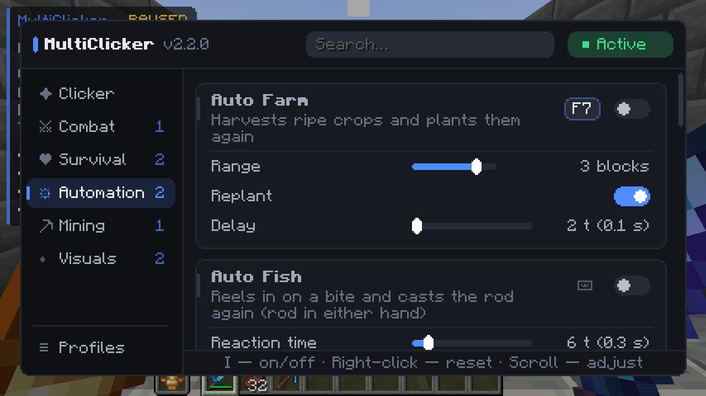
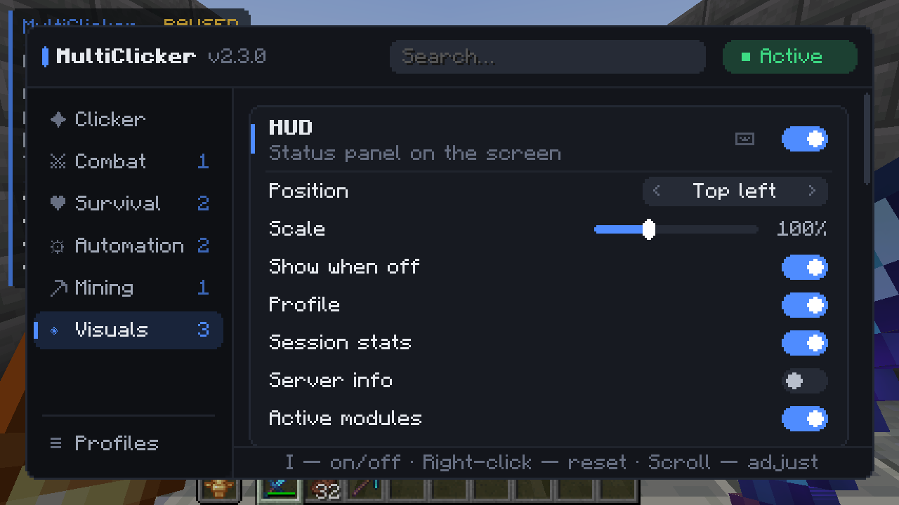

<div align="center">


# MultiClicker

**Auto clicker for Fabric, NeoForge and Forge with helpers for AFK farms, mining, farming and fishing.**

[](https://minecraft.net/)
[](https://fabricmc.net/)
[](https://neoforged.net/)
[](https://files.minecraftforge.net/)
[](https://github.com/Shamanalle/MultiClicker/releases/latest)
[](https://github.com/Shamanalle/MultiClicker/actions/workflows/gametest.yml)
[](LICENSE)

**English** · [Русский](README.ru.md)


</div>

Auto clicker mod for Minecraft 1.19 – 26.3 (Fabric, NeoForge and Forge). Clicks the attack, use and jump keys at a rhythm you set.
Includes modules for AFK farming, mining, crop farming and fishing: auto eat, auto fish, auto farm,
auto tool, hotbar refill, offhand, safety stop, anti-AFK and others. Every module, clicker channel and
profile can have its own hotkey.

## Quick start

1. Install [Fabric Loader](https://fabricmc.net/use/), [NeoForge](https://neoforged.net/) or
   [Forge](https://files.minecraftforge.net/) for your Minecraft version. Supported: 1.19 – 1.19.4,
   1.20 – 1.20.6, 1.21 – 1.21.11 and 26.1 – 26.3
   (see [versions](#supported-versions)).
2. Put the jar for your loader and version from the
   [latest release](https://github.com/Shamanalle/MultiClicker/releases/latest) into the `mods` folder:
   - Fabric: `MultiClicker-fabric-<mod version>+<Minecraft version>.jar` together with
     [Fabric API](https://modrinth.com/mod/fabric-api). Optional: [Mod Menu](https://modrinth.com/mod/modmenu)
     adds a settings button to the mod list.
   - NeoForge: `MultiClicker-neoforge-<mod version>+<Minecraft version>.jar`, nothing else is needed. The
     settings button is in the mod list.
   - Forge (1.19 – 1.20.1): `MultiClicker-forge-<mod version>+<Minecraft version>.jar`, nothing else is
     needed.
3. Join a world and press <kbd>O</kbd> to open the menu, <kbd>I</kbd> to turn the mod on or off.

Pick a ready-made setup under **Profiles → Presets**, then press <kbd>I</kbd>:

| Preset | What it sets up |
|:--|:--|
| **Mob farm** | Attacks on full charge with a small random delay. Passive mobs, pets and named mobs are left alone. Auto eat and anti-AFK are on. |
| **Mining** | The attack key is held, blocks are broken, auto tool picks the pickaxe, the clicker stops when the inventory is full. Auto eat is on. |
| **Fishing** | The clicker is off, auto fish reels in and casts again. Auto eat and anti-AFK are on. |
| **Farming** | The clicker is off, auto farm harvests ripe crops around you and plants them again, hotbar refill brings more seeds. Auto eat is on. |
| **AFK in place** | The clicker is off. Anti-AFK only sneaks, swings and switches the hotbar slot, so you never leave the spot. |

Your own settings can be saved as profiles: load one with a hotkey, have it load by itself on a server,
or share it with others as a line of text.

> Many multiplayer servers don't allow auto clickers. Check the rules before using the mod online.

## Features

Every option has a tooltip in the menu. Right-click a setting to reset it.

### Auto clicker
- **Three channels: attack (LMB), use (RMB) and jump.** Each one can *click* or *hold* the key and has
  its own speed, hold time, pause, random delay and hotkey.
- **Speed in ticks or in clicks per second.** Set an interval in ticks, or a rate such as 12 CPS: the
  fractions of a tick carry over, so the rate is kept on average.
- **Random delay of your choice.** *Even* (any value up to the maximum), *bell curve* (a steady rhythm
  around the middle) or *natural* (mostly short, now and then a longer pause, like a person).
- **Wait for full charge.** Attacks only when the weapon is charged, for full damage. Turn it off for
  1.8-style PvP.
- **Targets.** Only allowed creatures, creatures and blocks (mining), or anything, even into the air.
- **Pause while using items.** No attacks while you eat, drink, block or draw a bow.
- **Looting finishing blow.** Predicts whether the next hit kills. If so, it switches to the hotbar
  weapon with the best Looting, waits for it to charge, hits and switches back.
- **Start delay**, **attack limit** and **time limit**: the mod turns itself off when they run out.
- **Work in background.** The game keeps running when its window loses focus.
- **Lock camera.** Mouse movement doesn't turn the camera while the mod is on.
- Keys you hold yourself are not released. The clicker pauses while a screen is open.

### Target filter
Players, hostile, neutral and passive mobs and other entities (boats, minecarts, armor stands, end
crystals) are switched separately. On top of that: ignore babies, named mobs, pets and invisible
mobs.

### Survival
- **Safety.** Stops the mod, or leaves the server, when your health drops to a threshold, when you
  take any damage, or when another player comes within a set distance.
- **Offhand.** Keeps one item in the offhand, by priority: a totem at low health, food when
  you're hungry, a torch while you hold a pickaxe, otherwise a shield.
- **Auto eat.** Eats the best safe food from the hotbar, then returns to the previous slot. It can skip harmful
  food (rotten flesh, pufferfish, suspicious stew…) and golden food. It never opens the chest, door or
  villager you look at.

### Automation
- **Auto fish.** Reels in on a bite after a reaction time you set, casts again, recasts if nothing
  bites for too long, stops when the rod is about to break or after a number of catches. The rod can
  be in either hand.
- **Anti-AFK.** Jump, sneak, swing, look around, step or switch the hotbar slot for a moment, at random
  intervals between a minimum and a maximum. Each action can be turned off. Sneak, swing and the slot
  switch keep you on the spot; the slot switch also counts on servers that ignore swings and head turns.
- **Auto walk.** Walks forward, optionally sprinting and jumping over obstacles.
- **Auto farm.** Harvests ripe wheat, carrots, potatoes, beetroots, nether wart, cocoa and sweet berries
  around you (or only under the crosshair) and plants them again from the offhand or the hotbar.
- **Hotbar refill.** When the last item of a hotbar stack is used up, or a tool breaks, the same item
  comes in from the inventory; a stack can also be topped up before it runs out. The tool or weapon in
  your hand is swapped for a spare before it breaks, so a tool with Mending is kept.
- **Inventory cleaner.** Throws out the items from your junk list, one stack at a time. It never
  touches the hotbar unless you allow it.

### Mining
- **Mining rules.** A whitelist or blacklist of blocks the clicker may break, edited in a list editor
  with item icons. It can stop when the inventory is full and protect the held tool from breaking.
- **Auto tool.** Picks the fastest hotbar tool for the block, taking Efficiency into account, skips
  nearly broken tools and switches back afterwards.

### Interface
- **HUD.** A status panel in any corner with the scale you choose: the loaded profile, active channels,
  clicks per second, attacks, kills, session time, ping, server TPS, FPS and the list of active modules.
  Every line can be hidden.
- **Target highlight.** The creature about to be hit is outlined, filled or glowing, in a color you
  pick.
- **Menu.** Categories, module cards, search (also by English names), tooltips and a list editor with
  item icons. Click a number to type an exact value; changed settings are marked with a dot and a whole
  module can be reset with ↺. Fits the window size; on small screens the sidebar turns into icons.
- **Feedback.** Accent color, a sound and a message above the hotbar when the mod turns on or off.
- **Notifications.** A message above the hotbar or in the chat, with a chime, when something needs your
  attention while the mod works: the inventory is full, the tool in hand is about to break, the last item
  in hand is used up, auto eat finds no food, a player comes near, a fish is caught, or the mod stopped by
  itself and why. Each one can be turned off.
- **Hotkeys.** Any module, each clicker channel and each profile can get a key (or a side mouse button)
  that switches it while you play. Hotkeys stay as they are when you load a profile or a preset.
- **Profiles.** Save your settings under a name and load them later, with a hotkey or by themselves when
  you join a given server or single player. Copy a profile as a line of text to share it, and paste one
  you got from someone else.

## Screenshots

| | |
|:--:|:--:|
|  |  |
| Settings: every module is a card, with a tooltip for every option | Automation: auto farm with a hotkey, auto fish |
|  |  |
| Survival: safety, offhand and auto eat | Visuals: HUD and target highlight |
|  |  |
| Presets and your own profiles, with a hotkey, a server and sharing | List editor: item icons, add the held item or the block you look at |

## Supported versions

One jar per loader and Minecraft version:

| Minecraft | Fabric | NeoForge | Forge |
|:--|:--:|:--:|:--:|
| 1.19 – 1.19.4 | ✓ | — | ✓ |
| 1.20 | ✓ | — (NeoForge starts at 1.20.1) | ✓ |
| 1.20.1 | ✓ | ✓ (NeoForged Forge 47.1) | ✓ |
| 1.20.2 – 1.20.6 | ✓ | ✓ | — |
| 1.21 – 1.21.11 | ✓ | ✓ | — |
| 26.1 – 26.3 | ✓ | ✓ | — |

Minecraft 1.21.9 and newer needs Fabric Loader 0.17 or newer. NeoForge for 1.20.1 is the NeoForged fork of
Forge 47 (still with the Forge API); the 1.20.1 NeoForge jar is built for it and also runs on Forge 1.20.1,
so the 1.20.1 Forge jar is the same file.
From 1.20.2 on there are NeoForge jars only.

- Fabric 1.21.4 and newer: every build plays the in-game tests.
- Fabric 1.19 – 1.21.3 and every NeoForge and Forge version: CI checks that the game starts with the mod and that
  every mixin applies.
- Fabric 1.21.9: the outline and filled highlight styles are not drawn (Fabric API for this version has
  no world rendering events); the glow style works. On NeoForge and Forge all styles work.
- Before 1.19.3 search fields have no grey hint text.

## Controls

| Key | Action |
|:--:|:--|
| <kbd>I</kbd> | Turn the mod on / off |
| <kbd>O</kbd> | Open the settings |

Rebind them under *Options → Controls → Key Binds → MultiClicker*. Hotkeys for modules and channels are
set in the menu with the ⌨ button of a module card or the *Hotkey* row of a channel; hotkeys for profiles
are set in *Profiles*. Hotkeys do nothing while a menu or the chat is open.

In the menu, start typing to search, press <kbd>Tab</kbd> for the next category, use the mouse wheel or
the arrow keys to fine-tune sliders, or click a number to type it.

## Languages

English, Русский, Українська, Deutsch, Français, Español, Português (Brasil), Polski, Italiano,
Türkçe, 简体中文, 日本語, 한국어. Items, enchantments and mobs use the game's own names in each
language.

## Configuration

Settings are saved in `config/multiclicker.json` and profiles in `config/multiclicker/profiles/`.
The hotkeys and servers of the profiles are kept in `multiclicker.json`, so a shared profile never
brings someone else's keys. Settings from older versions are converted when they are loaded; a file
from a newer version is copied to `multiclicker.json.v<N>.bak` before this version saves over it.

## Building

You need JDK 21 (JDK 25 and Gradle 9 for Minecraft 26.1 and newer). The version is picked with
`-Pminecraft_version=<version>`; each one is described in `versions/<version>.properties`.

```bash
./gradlew build                       # → fabric/build/libs and neoforge/build/libs, runs the unit tests
./gradlew :common:test                # unit tests only: click timing, profiles, config files
./gradlew :fabric:runClientGameTest   # starts the game and plays every scenario
```

- `common/` holds the mod itself: modules, settings, the menu and the config.
- `fabric/` and `neoforge/` hold the entry points of the loaders; `neoforge/` also builds the Forge jar
  for the versions that name a `forge_version`.
- `common/src/test/` holds the unit tests, which need no running game.
- `fabric/src/gametest/` holds the in-game tests, which are not part of the release jar.

## License

[MIT](LICENSE).
