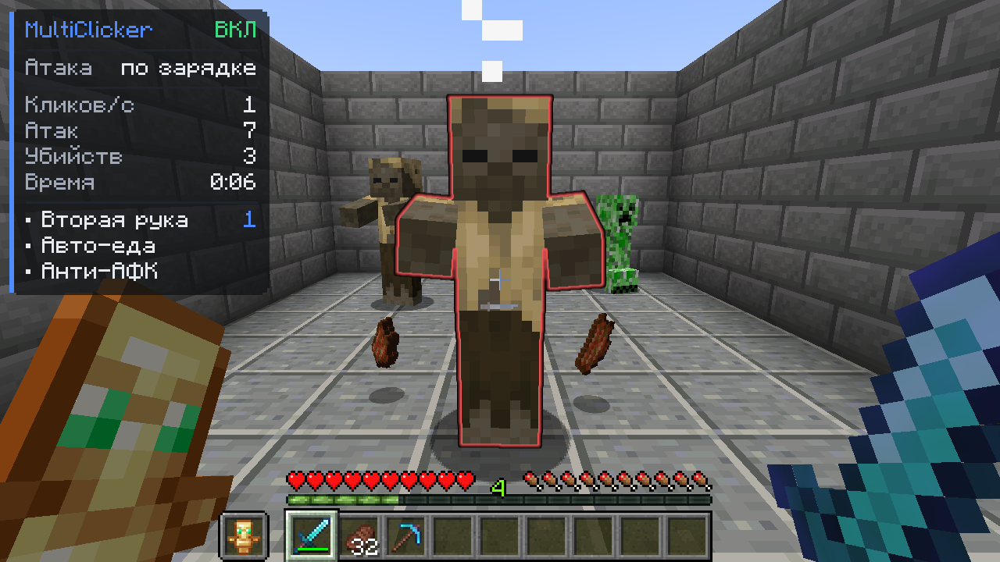
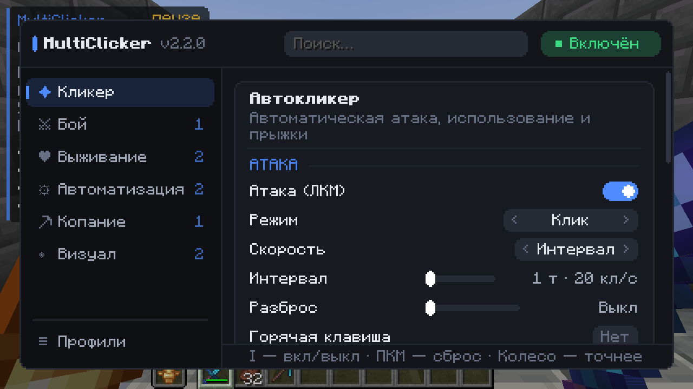
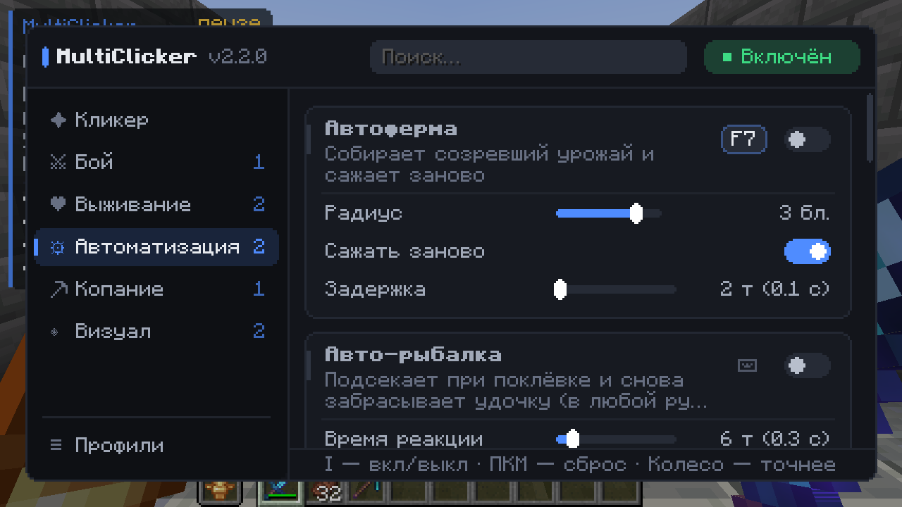
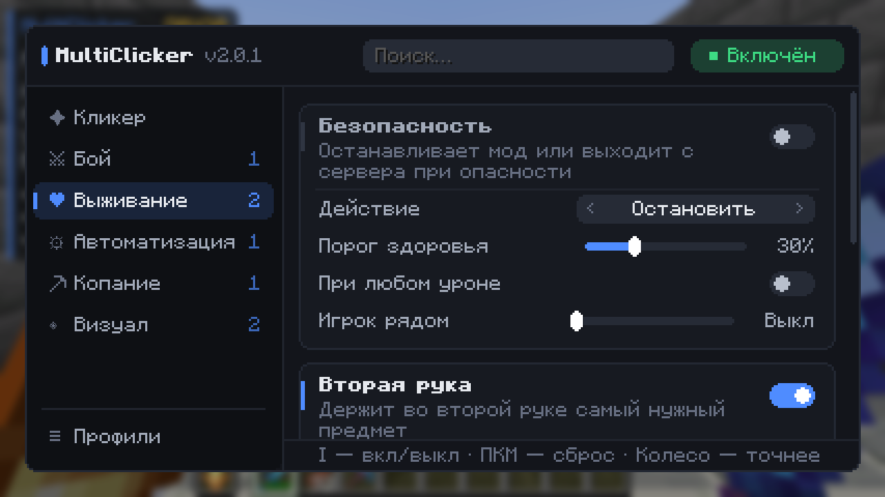
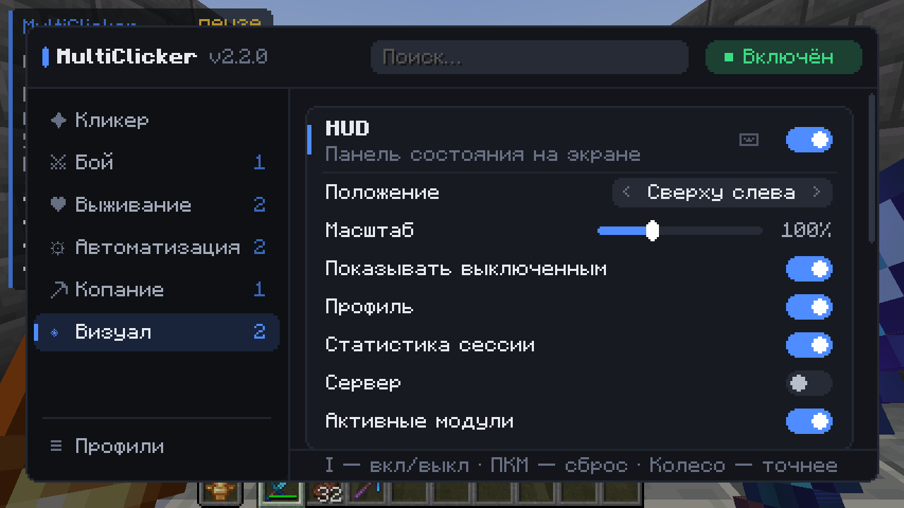
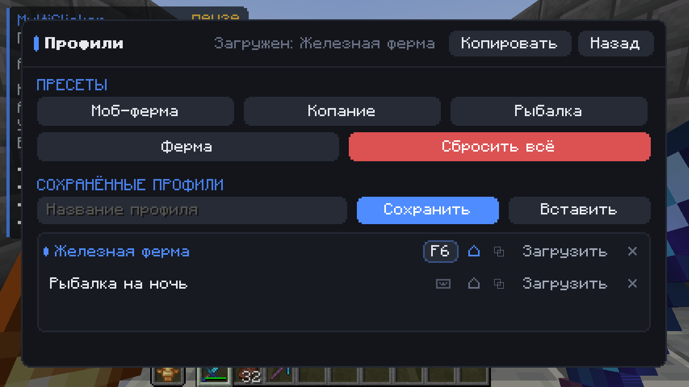
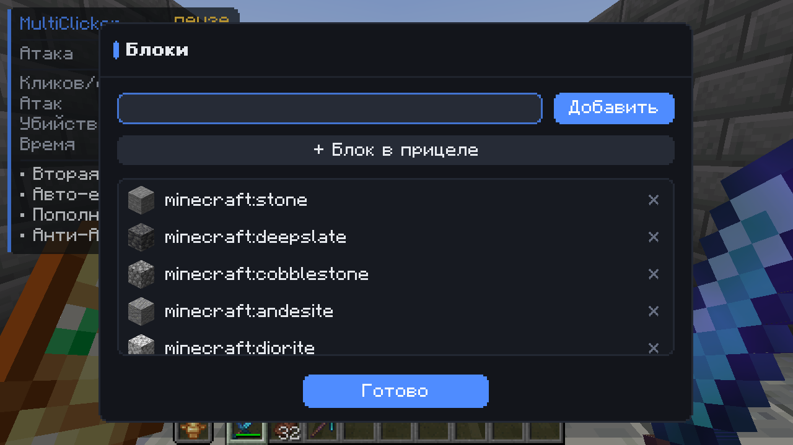

<div align="center">


# MultiClicker

**Автокликер для Fabric, NeoForge и Forge с помощниками для AFK-ферм, копания, фермы и рыбалки.**

[](https://minecraft.net/)
[](https://fabricmc.net/)
[](https://neoforged.net/)
[](https://files.minecraftforge.net/)
[](https://github.com/Shamanalle/MultiClicker/releases/latest)
[](https://github.com/Shamanalle/MultiClicker/actions/workflows/gametest.yml)
[](LICENSE)

[English](README.md) · **Русский**



</div>

Мод-автокликер для Minecraft 1.19 – 26.3 (Fabric, NeoForge и Forge). Нажимает клавиши атаки, использования и прыжка в заданном
ритме. Включает модули для AFK-ферм, копания, огорода и рыбалки: авто-еда, авто-рыбалка, автоферма,
авто-инструмент, пополнение хотбара, вторая рука, аварийная остановка, анти-АФК и другие. У каждого
модуля, канала кликера и профиля может быть своя горячая клавиша.

## Быстрый старт

1. Установите [Fabric Loader](https://fabricmc.net/use/), [NeoForge](https://neoforged.net/) или
   [Forge](https://files.minecraftforge.net/) для своей версии Minecraft. Поддерживаются 1.19 – 1.19.4,
   1.20 – 1.20.6, 1.21 – 1.21.11 и 26.1 – 26.3
   (см. [версии](#поддерживаемые-версии)).
2. Положите в папку `mods` jar под свой загрузчик и версию из
   [последнего релиза](https://github.com/Shamanalle/MultiClicker/releases/latest):
   - Fabric: `MultiClicker-fabric-<версия мода>+<версия Minecraft>.jar` (или диапазон версий, например
     `+1.21.6-1.21.8`) вместе с
     [Fabric API](https://modrinth.com/mod/fabric-api). По желанию поставьте
     [Mod Menu](https://modrinth.com/mod/modmenu): он добавляет кнопку настроек в списке модов.
   - NeoForge: `MultiClicker-neoforge-<версия мода>+<версия Minecraft>.jar`, больше ничего не нужно.
     Кнопка настроек есть в списке модов.
   - Forge (1.19 – 1.20.1): `MultiClicker-forge-<версия мода>+<версия Minecraft>.jar`, больше ничего не
     нужно.
3. Зайдите в мир, нажмите <kbd>O</kbd>, чтобы открыть меню, и <kbd>I</kbd>, чтобы включить или выключить мод.

Выберите готовую настройку в **Профили → Пресеты** и нажмите <kbd>I</kbd>:

| Пресет | Что настраивает |
|:--|:--|
| **Моб-ферма** | Атака на полной зарядке с небольшой случайной задержкой. Мирные мобы, питомцы и мобы с биркой не трогаются. Включены авто-еда и анти-АФК. |
| **Копание** | Клавиша атаки зажата, блоки ломаются, авто-инструмент берёт кирку, при полном инвентаре кликер останавливается. Включена авто-еда. |
| **Рыбалка** | Кликер выключен, авто-рыбалка подсекает и снова забрасывает. Включены авто-еда и анти-АФК. |
| **Ферма** | Кликер выключен, автоферма собирает созревший урожай вокруг и сажает заново, пополнение хотбара подкладывает семена. Включена авто-еда. |
| **AFK на месте** | Кликер выключен. Анти-АФК только приседает, взмахивает рукой и переключает слот хотбара, так что вы не сходите с места. |

Свои настройки можно сохранить в профиль: загружать его горячей клавишей, автоматически при входе
на сервер или поделиться им с другими одной строкой текста.

> На многих серверах автокликеры запрещены. Проверьте правила, прежде чем играть с модом по сети.

## Возможности

У каждой опции в меню есть подсказка. Правый клик по настройке сбрасывает её.

### Автокликер
- **Три канала: атака (ЛКМ), использование (ПКМ) и прыжок.** Каждый умеет *кликать* или *держать*
  клавишу, у каждого своя скорость, время удержания, пауза, случайная задержка и горячая клавиша.
- **Скорость в тиках или в кликах в секунду.** Задайте интервал в тиках или темп вроде 12 кл/с: доли
  тика переносятся, так что темп держится в среднем.
- **Случайная задержка на выбор.** *Равномерная* (любое значение до максимума), *колокол* (ровный ритм
  около середины) или *естественная* (чаще коротко, изредка пауза подольше, как у человека).
- **Ждать полной зарядки.** Бьёт только заряженным оружием, чтобы урон был максимальным. Для PvP
  в стиле 1.8 это выключается.
- **Цели.** Только разрешённые существа, существа и блоки (копание) или что угодно, даже в воздух.
- **Пауза при использовании.** Не бьёт, пока вы едите, пьёте, закрываетесь щитом или тянете лук.
- **Добивать «Добычей».** Предсказывает, убьёт ли следующий удар. Если да, берёт из хотбара оружие
  с лучшей «Добычей», ждёт его зарядки, бьёт и возвращает прежний слот.
- **Задержка старта**, **лимит атак** и **лимит времени**: по их исчерпании мод выключается сам.
- **Работать в фоне.** Игра не встаёт на паузу, когда окно теряет фокус.
- **Фиксировать камеру.** Движение мыши не поворачивает камеру, пока мод включён.
- Клавиши, которые вы держите сами, не отпускаются. При открытом экране кликер на паузе.

### Фильтр целей
Игроки, враждебные, нейтральные и мирные мобы и прочие сущности (лодки, вагонетки, стойки для брони,
кристаллы Энда) включаются по отдельности. Дополнительно можно не трогать детёнышей, мобов с биркой,
питомцев и невидимых.

### Выживание
- **Безопасность.** Останавливает мод или выходит с сервера, когда здоровье падает до порога, при
  любом уроне или когда рядом появляется другой игрок.
- **Вторая рука.** Держит один предмет по приоритету: тотем при малом здоровье, еда при голоде,
  факел к кирке, иначе щит.
- **Авто-еда.** Ест лучшую безопасную еду из хотбара, затем возвращается на прежний слот. Может пропускать вредную еду
  (гнилую плоть, иглобрюха, подозрительное рагу…) и золотую. Никогда не открывает сундук, дверь или
  торговлю жителя, на которых вы смотрите.

### Автоматизация
- **Авто-рыбалка.** Подсекает при поклёвке через заданное время реакции, забрасывает снова,
  перезабрасывает, если долго нет поклёвки, останавливается, когда удочка почти сломана или
  после заданного числа уловов. Удочка может быть в любой руке.
- **Анти-АФК.** Прыжок, присед, взмах рукой, поворот камеры, шаг или мгновенная смена слота хотбара через
  случайные интервалы между минимумом и максимумом. Каждое действие можно отключить. Присед, взмах и смена
  слота не сдвигают вас с места; смена слота засчитывается даже на серверах, которые не замечают взмахи и
  повороты головы.
- **Авто-ходьба.** Идёт вперёд, при желании бежит и перепрыгивает препятствия.
- **Автоферма.** Собирает созревшие пшеницу, морковь, картофель, свёклу, незерский нарост, какао и
  сладкие ягоды вокруг вас (или только под прицелом) и снова сажает их из второй руки или хотбара.
- **Пополнение хотбара.** Когда последний предмет стака на хотбаре израсходован или инструмент сломался,
  такой же предмет переносится из инвентаря; стак можно добирать и заранее. Инструмент или оружие в
  руке меняется на запасной, пока не сломался, так что инструмент с «Починкой» сохраняется.
- **Очистка инвентаря.** Выбрасывает предметы из списка мусора по одному стаку. Хотбар не трогает,
  пока вы не разрешите.

### Копание
- **Правила копания.** Белый или чёрный список блоков, которые кликеру можно ломать. Список
  редактируется в редакторе с иконками предметов. Может останавливаться при полном инвентаре и беречь
  инструмент в руке от поломки.
- **Авто-инструмент.** Берёт из хотбара самый быстрый инструмент для блока (с учётом «Эффективности»),
  пропускает почти сломанные и потом возвращает слот.

### Интерфейс
- **HUD.** Панель состояния в любом углу и нужного масштаба: загруженный профиль, активные каналы,
  клики в секунду, удары, убийства, урон, улов, урожай, время сессии (по желанию — со скоростью в час),
  пинг, TPS сервера, FPS и список активных модулей. Любую строку можно скрыть.
- **Подсветка цели.** Существо, которое сейчас ударят, обводится контуром, заливается или светится
  выбранным цветом.
- **Меню.** Категории, карточки модулей, поиск (в том числе по английским названиям), подсказки и
  редактор списков с иконками предметов. По клику на число можно ввести точное значение; изменённые
  настройки отмечены точкой, а весь модуль сбрасывается кнопкой ↺. Подстраивается под размер окна;
  на маленьком экране боковая панель превращается в иконки.
- **Обратная связь.** Цвет акцента, звук и сообщение над хотбаром при включении и выключении мода.
- **Уведомления.** Сообщение над хотбаром или в чате со звуком, когда во время работы мода что-то
  требует внимания: инвентарь заполнен, инструмент в руке вот-вот сломается, последний предмет в руке
  закончился, авто-еда не нашла еды, рядом появился игрок, поймана рыба или мод сам остановился (и
  почему). Каждое можно выключить.
- **Статистика.** Что сделал мод, с сохранением между играми: за сессию, по каждому серверу и за всё
  время, плюс последние 20 сессий. Клики, убийства по мобам, урон и DPS, улов по видам и предметам,
  урожай, добытые блоки, еда, тотемы, смерти, опыт и другое, со скоростью в час. Для текущей сессии —
  график реальных кликов в секунду против заданных за последнюю минуту и диаграмма по минутам. Урон
  измеряется по здоровью мобов, поэтому он точный; если сервер скрывает здоровье, мод так и пишет, а не
  угадывает. Экспорт в CSV, сброс вторым нажатием и итог сессии в чате при выключении.
- **Горячие клавиши.** Любому модулю, каждому каналу кликера и каждому профилю можно назначить клавишу
  (или боковую кнопку мыши), которая переключает его прямо в игре. При загрузке профиля или пресета
  горячие клавиши не меняются.
- **Профили.** Настройки сохраняются под именем и загружаются позже: горячей клавишей или сами при
  входе на нужный сервер или в одиночную игру. Профиль можно скопировать строкой текста, чтобы
  поделиться, и вставить чужой.

## Скриншоты

| | |
|:--:|:--:|
|  |  |
| Настройки: у каждого модуля своя карточка, у каждой опции подсказка | Автоматизация: автоферма с горячей клавишей, авто-рыбалка |
|  |  |
| Выживание: безопасность, вторая рука и авто-еда | Визуал: HUD и подсветка цели |
|  |  |
| Пресеты и свои профили: горячая клавиша, сервер, обмен | Редактор списков: иконки предметов, добавление предмета из руки или блока в прицеле |

## Поддерживаемые версии

Для каждого загрузчика и версии Minecraft свой jar, а для версий, под которые мод собирается в один и тот же
код, — общий на диапазон (например, `MultiClicker-fabric-<версия мода>+1.21.6-1.21.8.jar` для 1.21.6, 1.21.7 и
1.21.8):

| Minecraft | Fabric | NeoForge | Forge |
|:--|:--:|:--:|:--:|
| 1.19 – 1.19.4 | ✓ | — | ✓ |
| 1.20 | ✓ | — (NeoForge начинается с 1.20.1) | ✓ |
| 1.20.1 | ✓ | ✓ (NeoForged Forge 47.1) | ✓ |
| 1.20.2 – 1.20.6 | ✓ | ✓ | — |
| 1.21 – 1.21.11 | ✓ | ✓ | — |
| 26.1 – 26.3 | ✓ | ✓ | — |

Для Minecraft 1.21.9 и новее нужен Fabric Loader 0.17 или новее. NeoForge для 1.20.1 — это форк Forge 47
от NeoForged (ещё с API Forge); jar NeoForge для 1.20.1 собран под него и работает и на Forge 1.20.1,
поэтому jar для Forge 1.20.1 — тот же файл.
С 1.20.2 есть только jar для NeoForge.

- Fabric 1.21.4 и новее: каждая сборка проходит игровые тесты.
- Fabric 1.19 – 1.21.3 и все версии NeoForge и Forge: CI проверяет, что игра запускается с модом и все миксины
  применяются.
- Fabric 1.21.9: стили подсветки «контур» и «заливка» не рисуются (в Fabric API для этой версии нет
  событий отрисовки мира), «свечение» работает. На NeoForge и Forge работают все стили.
- До 1.19.3 в полях поиска нет серой подсказки.

## Управление

| Клавиша | Действие |
|:--:|:--|
| <kbd>I</kbd> | Включить / выключить мод |
| <kbd>O</kbd> | Открыть настройки |

Клавиши меняются в *Настройки → Управление → Назначение клавиш → MultiClicker*. Горячие клавиши модулей
и каналов назначаются в меню: кнопка ⌨ на карточке модуля или строка *Горячая клавиша* у канала;
клавиши профилей — в разделе *Профили*. Пока открыто меню или чат, горячие клавиши не срабатывают.

В меню можно просто начать печатать, чтобы найти настройку, <kbd>Tab</kbd> переключает категорию,
колесо мыши и стрелки точно подстраивают ползунки, а по клику на число его можно ввести.

## Языки

English, Русский, Українська, Deutsch, Français, Español, Português (Brasil), Polski, Italiano,
Türkçe, 简体中文, 日本語, 한국어. Предметы, чары и мобы в каждом языке называются так же, как в самой игре.

## Настройки

Настройки хранятся в `config/multiclicker.json`, профили в `config/multiclicker/profiles/`.
Горячие клавиши и серверы профилей лежат в `multiclicker.json`, поэтому чужой профиль никогда не приносит
чужих клавиш. Настройки старых версий переводятся в новый формат при загрузке; файл из более новой
версии перед сохранением копируется в `multiclicker.json.v<N>.bak`.
Статистика хранится в `config/multiclicker/stats.json`, экспорт в CSV сохраняется рядом.

## Сборка

Нужен JDK 21 (для Minecraft 26.1 и новее — JDK 25 и Gradle 9). Версия выбирается через
`-Pminecraft_version=<версия>`; каждая описана в `versions/<версия>.properties`.

```bash
./gradlew build                       # → fabric/build/libs и neoforge/build/libs, плюс юнит-тесты
./gradlew :common:test                # только юнит-тесты: тайминги кликов, профили, файлы настроек
./gradlew :fabric:runClientGameTest   # запускает игру и проигрывает все сценарии
```

- `common/` содержит сам мод: модули, настройки, меню и конфиг.
- `fabric/` и `neoforge/` содержат точки входа загрузчиков; `neoforge/` также собирает jar для Forge
  для версий, где указан `forge_version`.
- `common/src/test/` содержит юнит-тесты, им не нужна запущенная игра.
- `fabric/src/gametest/` содержит игровые тесты. В релизный jar они не попадают.

## Лицензия

[MIT](LICENSE).
